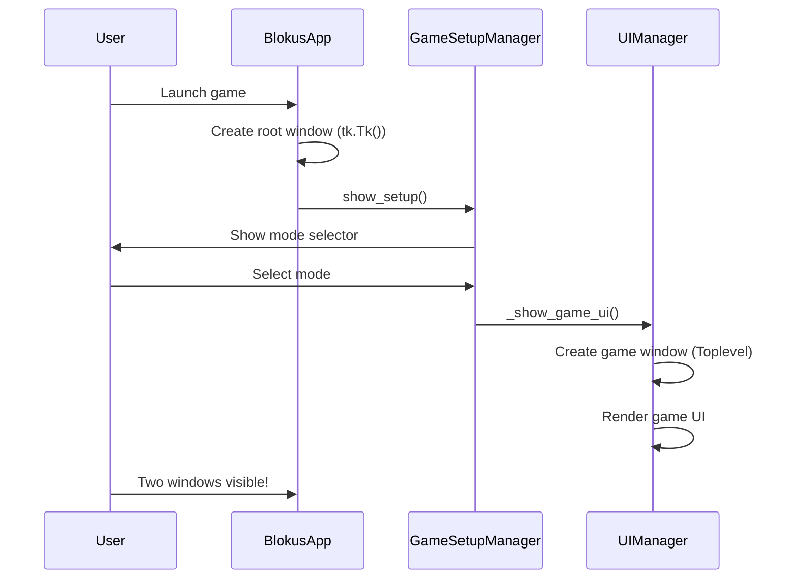

# Design Document: Remove Blank Root Window

## Overview

This design document explains the window management issue in the Blokus game application and the chosen solution to hide the unused root window.

## Problem Analysis

### Current Window Flow



### Window Hierarchy

```
Root Window (tk.Tk) - BLANK, UNUSED
└── Modal Dialogs (Toplevel)
    └── Game Window (Toplevel) - ACTUAL GAME
        └── Child UI Components
```

## Solution Design

### Chosen Approach: Hide Root Window

**Implementation**: Add `self.root.withdraw()` call in `_show_game_ui()` method

**Why This Works**:
- `withdraw()` hides window from screen but keeps it in window manager
- Window still exists for modal dialog hierarchy
- Simple, single-line change
- No side effects on game logic

**Code Change**:
```python
def _show_game_ui(self) -> None:
    """Show the game UI (delegated to UIManager)."""
    # Get game state and placement handler from setup manager
    self.ui_manager.set_context(...)
    self.ui_manager.show_game_ui()

    # NEW: Hide the unused root window
    self.root.withdraw()

    # ... rest of method unchanged
```

### Alternative Approaches Considered

#### Alternative 1: Destroy Root Window
**Implementation**: Use `self.root.destroy()` after game UI creation

**Pros**:
- Completely removes unused window

**Cons**:
- May break modal dialogs that reference root window
- Requires verifying all Toplevel windows have explicit parent
- Higher risk of breaking changes

**Rejected Because**: Too risky for a simple cosmetic fix

#### Alternative 2: Create Game Window as Main Window
**Implementation**: Refactor to use single window throughout

**Pros**:
- More conceptually correct

**Cons**:
- Large refactoring effort
- Changes window management throughout application
- High complexity for minimal benefit

**Rejected Because**: Over-engineering for the scope of the issue

## Implementation Details

### Modified File: src/blokus_game/main.py

**Location**: `_show_game_ui()` method (lines ~131-141)

**Change**:
```python
def _show_game_ui(self) -> None:
    """Show the game UI (delegated to UIManager)."""
    # Get game state and placement handler from setup manager
    self.ui_manager.set_context(...)
    self.ui_manager.show_game_ui()

    # Hide the blank root window - only game window should be visible
    self.root.withdraw()

    # Set up event handler callbacks now that UI components exist
    # ... rest of method unchanged
```

### Rationale for Placement

**Why after `self.ui_manager.show_game_ui()`**:
1. Ensures game window is fully created before hiding root
2. Prevents any race conditions with window creation
3. Clear sequence: create game UI, then hide root

**Why not in `UIManager.show_game_ui()`**:
- UIManager shouldn't manage root window (separation of concerns)
- BlokusApp is responsible for window lifecycle

## Testing Strategy

### Unit Testing
- No unit tests needed (UI change, tested manually)
- Existing tests should continue to pass

### Manual Testing
1. Launch scenarios:
   - `uv run python -m blokus_game.main` - all modes
   - Select each game mode and verify single window
   - Verify window functionality (resize, close, etc.)

2. Dialog Testing:
   - Help dialog (? button)
   - Quit confirmation (Ctrl+Q)
   - Performance metrics (debug mode)

3. Cross-platform:
   - Test on macOS (current platform)
   - Verify behavior matches expectations

### Regression Testing
- Run full test suite: `uv run pytest tests/ -v`
- Verify no failures in existing tests
- Check integration tests specifically

## Impact Assessment

### Positive Impacts
- ✅ Cleaner UI experience
- ✅ Reduced window clutter
- ✅ Matches user expectations

### No Negative Impacts
- ✅ No performance impact
- ✅ No functional changes
- ✅ No breaking changes
- ✅ Easy to revert

### Risk Analysis
- **Risk Level**: Very Low
- **Reason**: Single line change, well-tested tkinter API (`withdraw()`)
- **Mitigation**: Easy rollback if needed

## Future Considerations

### Modal Dialog Behavior
The root window is kept in memory (just hidden), which means:
- Modal dialogs can still use it as transient parent
- Dialogs will correctly center relative to game window
- No changes needed to dialog creation code

### Potential Enhancements
If more window management issues arise in future:
- Consider creating a dedicated WindowManager class
- Centralize window creation and lifecycle management
- Implement window state tracking

## Conclusion

The chosen solution (hiding root window with `withdraw()`) is:
- Simple and minimal
- Low risk
- Solves the user-reported issue completely
- Maintains backward compatibility
- Easy to understand and maintain
